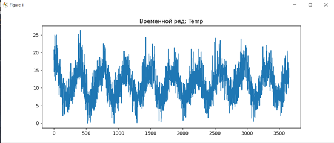
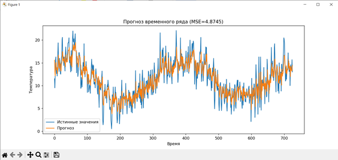
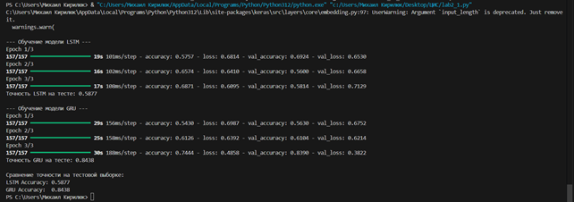
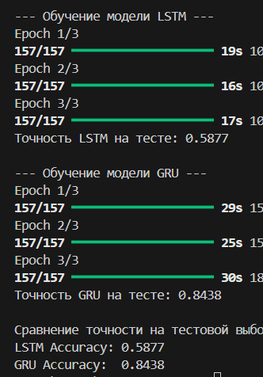

# Лабораторная работа № 2  
## Рекуррентные нейронные сети (RNN, LSTM, GRU)

---

## Цель работы

Целью лабораторной работы является практическое освоение принципов работы рекуррентных нейронных сетей и их модификаций — Simple RNN, Long Short-Term Memory (LSTM) и Gated Recurrent Unit (GRU).  
В рамках работы изучаются методы подготовки последовательных данных, анализируется способность моделей улавливать долгосрочные зависимости, а также проводится сравнение эффективности различных архитектур на задачах прогнозирования временных рядов и классификации текстов.

---

## Теоретическое введение

Рекуррентные нейронные сети (RNN) предназначены для обработки последовательных данных, таких как временные ряды и текст. Основной особенностью RNN является наличие скрытого состояния, которое передаётся от одного шага последовательности к следующему, позволяя модели учитывать предыдущий контекст.

**Simple RNN** представляет собой базовую рекуррентную архитектуру, однако на практике плохо справляется с долгосрочными зависимостями из-за проблемы затухающих градиентов.

**LSTM (Long Short-Term Memory)** решает эту проблему за счёт использования специальных управляющих вентилей, которые регулируют процесс сохранения и забывания информации во внутренней памяти сети.

**GRU (Gated Recurrent Unit)** является упрощённой версией LSTM. Она содержит меньше параметров и вентилей, что делает её более вычислительно эффективной при сохранении высокого качества обучения.

---

## Часть 1. Прогнозирование временных рядов

### Датасет

Для задачи прогнозирования использован датасет **Daily Minimum Temperatures**.

- Источник: открытый репозиторий Jason Brownlee  
- Тип данных: числовой временной ряд  
- Размер выборки: около 3600 наблюдений  
- Целевая переменная: значение температуры следующего дня  

---

### Предобработка данных

На этапе предобработки данных выполнены следующие действия:

- нормализация значений временного ряда в диапазон от 0 до 1 с использованием `MinMaxScaler`;
- формирование оконных выборок длиной 20 значений, где каждое окно используется для прогнозирования следующего шага;
- разделение данных на обучающую и тестовую выборки в соотношении 80/20;
- преобразование данных к формату `(samples, timesteps, features)` для подачи в рекуррентную сеть.

---

### Архитектура моделей

Для сравнения были реализованы три модели с одинаковой структурой выходного слоя:

- модель на основе **Simple RNN**;
- модель на основе **LSTM**;
- модель на основе **GRU**.

Каждая модель содержит один рекуррентный слой с 50 нейронами и полносвязный выходной слой.

Пример архитектуры:
```python
model.add(SimpleRNN(50, activation='tanh', input_shape=(window_size, 1)))
model.add(Dense(1))

### Гиперпараметры обучения

- длина окна: 20  
- количество эпох: 50  
- размер батча: 32  
- оптимизатор: Adam  
- функция потерь: Mean Squared Error (MSE)  

---

### Графики обучения

В процессе обучения для каждой модели были построены графики функции потерь на тренировочной и валидационной выборках. Это позволило сравнить скорость сходимости и стабильность обучения различных архитектур рекуррентных нейронных сетей.

**Рисунок 1 — Временной ряд Temp**  


**Рисунок 2 — Прогноз временного ряда**  


---

### Результаты на тестовой выборке

Для оценки качества прогнозирования использовалась метрика **Mean Squared Error (MSE)**.  
Анализ визуализации прогнозов показал, что модели **LSTM** и **GRU** более точно повторяют динамику временного ряда по сравнению с **Simple RNN**, особенно на участках с выраженными колебаниями и изменениями тренда.

---

## Часть 2. Классификация текстовых отзывов

### Датасет

Для задачи классификации использован датасет **IMDb Reviews**.

- источник: TensorFlow Datasets  
- тип задачи: бинарная классификация  
- количество классов: 2 (позитивный и негативный отзыв)  
- размер выборки:  
  - обучающая: 25 000 примеров  
  - тестовая: 25 000 примеров  

---

### Предобработка данных

Для подготовки текстовых данных были выполнены следующие этапы:

- токенизация текстов и формирование словаря;
- ограничение размера словаря до 10 000 слов;
- преобразование текстов в числовые последовательности;
- выравнивание длины последовательностей до 200 с помощью padding;
- использование слоя **Embedding** для векторного представления слов.

---

### Архитектура моделей

Для классификации текстовых отзывов реализованы две нейронные модели.

**LSTM-модель**

Embedding → LSTM → Dense(sigmoid)

**GRU-модель**

Embedding → GRU → Dense(sigmoid)

---

### Гиперпараметры обучения

- количество эпох: 3  
- размер батча: 128  
- оптимизатор: Adam  
- функция потерь: Binary Crossentropy  
- метрика качества: Accuracy  

---

### Результаты на тестовой выборке

**Рисунок 3 — MSE**  


**Рисунок 4 — Обучение моделей 1–2**  


Итоговые значения точности классификации:

- **LSTM Accuracy:** 0.5877  
- **GRU Accuracy:** 0.8438  

Модель **GRU** показала значительно более высокую точность по сравнению с моделью **LSTM**.

---

## Выводы

В ходе лабораторной работы были изучены и реализованы рекуррентные нейронные сети различных типов.

В результате экспериментов установлено, что:

- простая RNN плохо справляется с задачами, требующими запоминания долгосрочных зависимостей;
- архитектуры LSTM и GRU демонстрируют более высокое качество прогнозирования временных рядов;
- модель GRU показала наилучшие результаты в задаче классификации текстов;
- увеличение длины окна и длины последовательностей повышает информативность входных данных, но увеличивает вычислительную сложность обучения.

Полученные результаты подтверждают эффективность использования LSTM и GRU для задач анализа последовательных данных.
